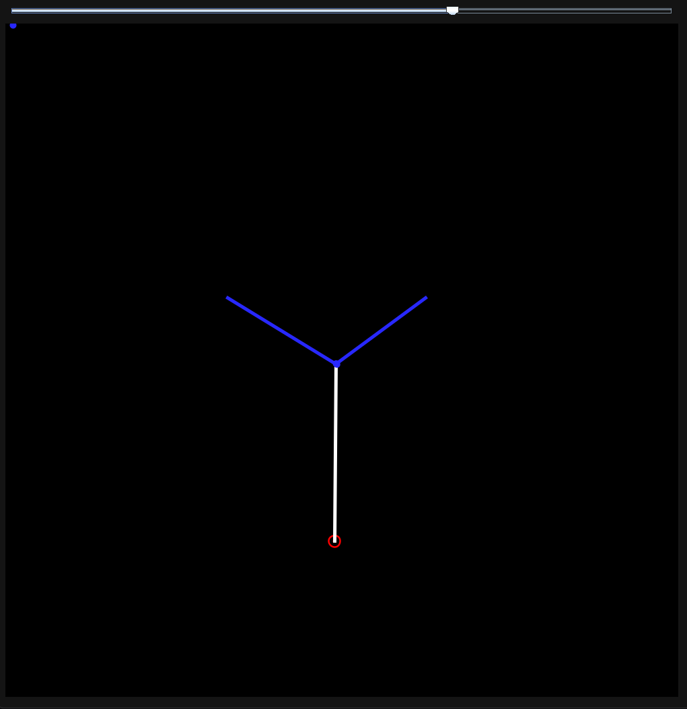
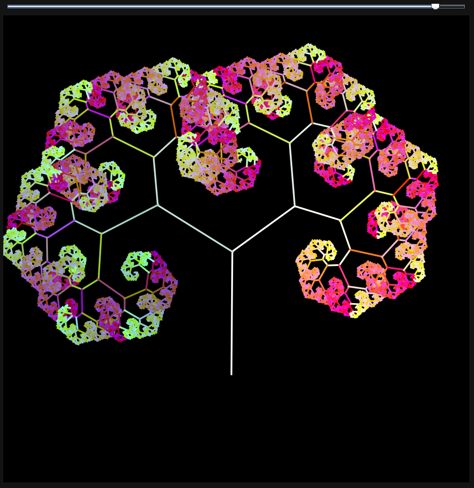
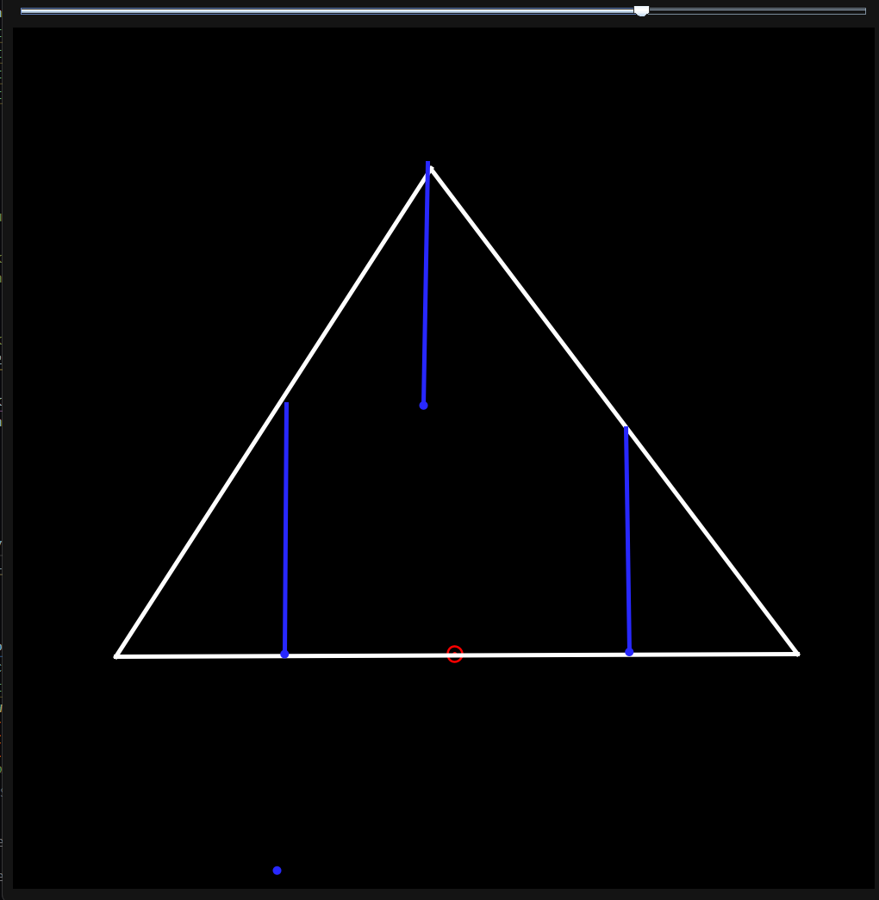
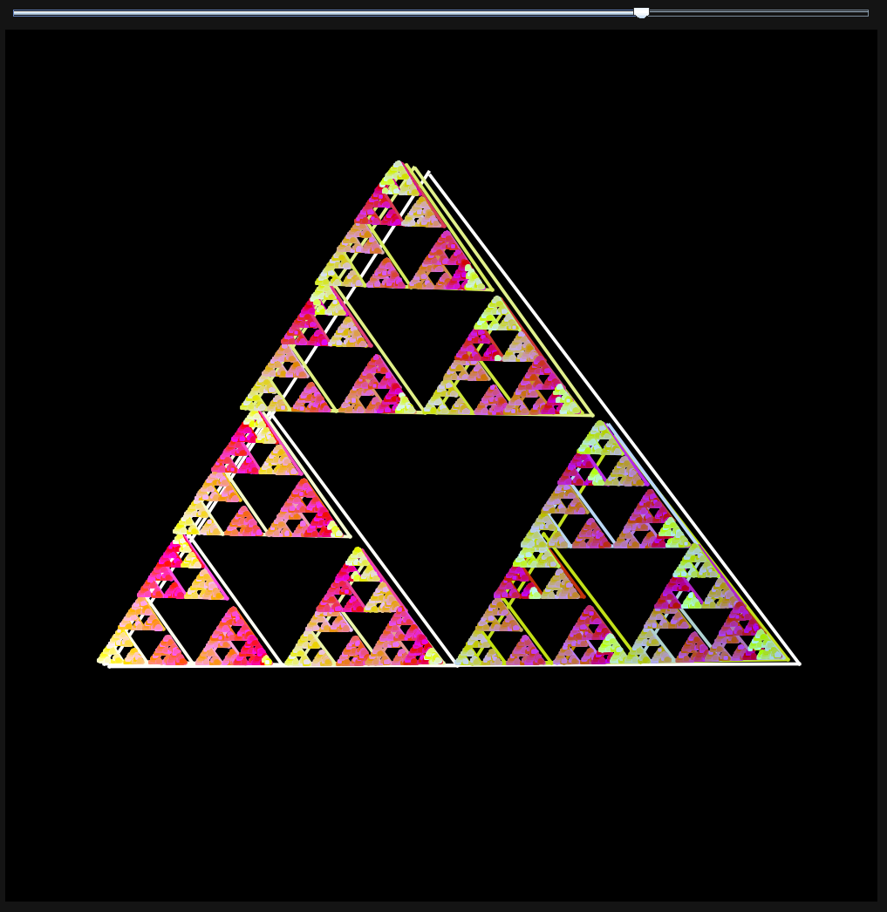

# FractalMaker
An easy way to make simple fractals that just include duplicating the same shape over and over, such as the fractal tree or the sierpinski triangle.
The whole program is your canvas.

### Controls (keyboard + left click)
On keyboard press:

1 - Add origin point, the place from where the drawn shape will be duplicated. There can be only 1 of these points. It must be the first thing you've drawn. It can be moved.

2 - (Drag and release) Draw a line. This is going to be your shape. You can draw any shape you wish to

3 - (Drag and release) Duplication point. The point where you first click dictates the place from where the shape will be drawn again. The length and rotation of the line dictate the size and rotation.

ENTER - Once you've drawn all you wish to, press ENTER and render out your created shape.

On top, you can control the depth of the fractal, how many times the whole thing will be duplicated for each duplication point.
This is an unoptimized, single threaded program, so it may take a while for everything to render, if the number is large, or if you use too many duplication points.

It is recommended to start with just 2 duplication points, making a simple fractal tree, to test the program out, leaving the depth slider on the default value, as more points and more depth will dramatically increase the lag.

# Examples:

Design in edit mode:

Final product:

Design in edit mode:

Final product:

You can see how fractals are made step by step and also see how they change depending on their starting location:
